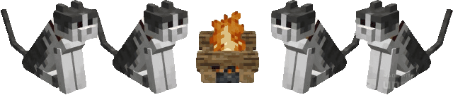

# _Olá, me chamo Juan Madeira!_

&nbsp;&nbsp;Estudante em bacharelado de Sistemas de Informação na Universidade Federal do Rio Grande (FURG) 
 
&nbsp;&nbsp;Técnico em Informática para Internet pelo Instituto Federal do Rio Grande do Sul (IFRS)

 

## _Ferramentas e tecnologias que utilizo ou estou estudando_

    
    &nbsp;&nbsp;
    
    &nbsp;&nbsp;
    
    &nbsp;&nbsp;
    
    &nbsp;&nbsp;
    
    &nbsp;&nbsp;
    
    &nbsp;&nbsp;
    

 

---

    <mark>Entre em contato!</mark>
     
    
    &nbsp;&nbsp;
    

